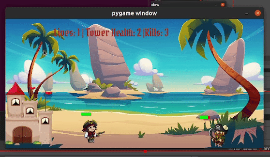

# Fortress-Siege

Fortress-Siege is a tower defense game where players must protect their fortress from incoming wave of enemies. The game consists of a hero character that can move left or right, jump, and shoot bullets. The hero has a health bar, and the goal is to defeat enemies and survive as long as possible. As the game progress, the difficulty level and the speed of enemy increases.

## Demo

## Tech Stack

Pygame - 2.1.2

## Contributors

- [@Fathima Nooha](https://github.com/nooha01)
- [@Angath JR](https://github.com/angathjr)

## How it Works ?

The Hero class contains all the information and functions related to the hero character. It initializes and controls the hero's position, velocity, health, and lives. The move_hero function handles left and right movements, while jump_motion controls jumping. The draw function displays the hero, and cooldown handles bullet firing rate.

The game loop starts with user input, updates the hero's position, and checks for collisions with enemies and bullets. If the hero loses all lives or the game window is closed, the loop ends. Pygame is then quit to end the program.

## How to configure and run

1. Clone the repository to your local machine `https://github.com/nooha01/Fortress-Siege.git`.
2. Install Pygame using `pip install pygame`.
3. Run `python Game.py` or `python3 Game.py` on your terminal. 
4. Enjoy the game. 

## Attribution

- Background image from [Freepik](https://www.freepik.com/free-vector/tropical-beach-landscape-with-palm-trees-golden-sand-rocks-blue-water-sky-with-fluffy-clouds-beautiful-paradise-seaside-island-ocean-game-location-cartoon-2d-vector-illustration_26177901.htm)
- Tower image from [Freepik](https://www.freepik.com/free-vector/simple-cartoon-style-castle-isolated-white_14803249.htm)
- Character sprites from [free-game-assets](https://free-game-assets.itch.io/free-2d-pirate-sprites)
- Game sound effects from [Zedge](https://www.zedge.net/ringtone/e56e7117-f787-475b-a535-44b8cb086a8d)
- Game Font from [Google fonts](https://fonts.google.com/specimen/Pirata+One)
